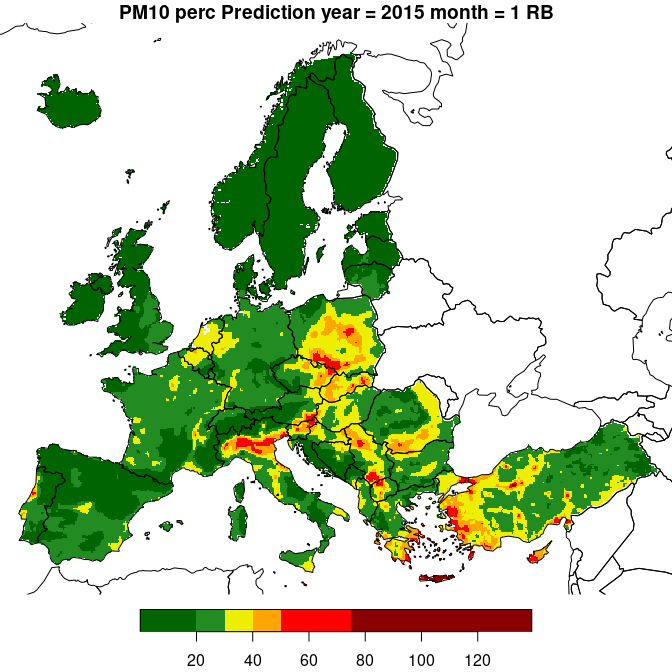
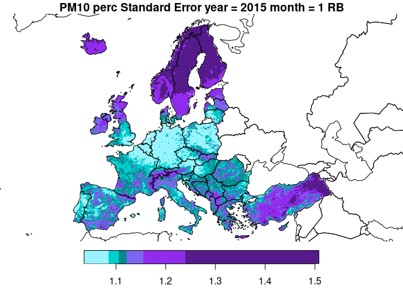

# AQ Interpolation and Map Merging
Johannes Heisig
2026-03-26

``` r
library(dplyr)
library(tictoc)

source("/palma/home/j/jheisig/oemc_aq/functions.R")
```

## Read AQ Data

Daily, monthly, or annual aggregates of AQ measurement data are imported
according using `load_aq()`. Required inputs are the `pollutant`, the
aggregation statistic (‘mean’ or ‘perc’) and a temporal selection.
Specifying only the year (`y`) returns annual data. Additionally,
specifying **either** the month (`m`) **or** the day of the year (`d`)
returns monthly or daily data, respectively.

``` r
y = 2015
m = 1
pollutant = "PM10"
stat = "perc"

aq = load_aq(pollutant, stat, y, m) 
```

    MONTHLY PM10 data. Year = 2015 ; Month = 1 ; Variable = PM10_perc; n = 1681

## Add Covariates

Covariates are then loaded based using `load_covariates_EEA()`. The
temporal extent is extracted from the AQ measurement data object.
Thereby each covariate raster layer is warped to match the spatial grid
of the 1 x 1 km Corine Land Cover (CLC) dataset. Warping is faster when
setting `parallel=TRUE`.

By default our data covers the CAMS grid, which ranges from -25° to 45°
longitude and 30° to 72° latitude. We can limit the extent by supplying
a bounding box in the CRS of the data (*ETRS89-extended / LAEA Europe
(EPSG: 3035)*). For this example we limit the covariates to mainland
Europe and exclude e.g. Azores and Canary Islands.

Note: EEA uses different combinations of covariates for each pollutant,
which the function accounts for.

- PM10: log_cams, elevation, ws, rh, clc
- PM2.5: log_cams, elevation, ws, clc
- O3: cams, elevtion, ws, ssr
- NO2: cams, elevation, elevation 5km, ws, ssr, S5P, pop, clc, clc 5km

``` r
dem = readRDS("supplementary/static/COP-DEM/COP_DEM_Europe_mainland_10km_mask_epsg3035.rds")

aq_cov = load_covariates(aq, dem)

aq_cov
```

    stars object with 2 dimensions and 5 attributes
    attribute(s):
                         Min.   1st Qu.     Median       Mean    3rd Qu.
    log_CAMS_PM10   0.5119475  2.534636   2.979426   2.787324   3.229174
    WindSpeed       0.4430067  1.968941   2.663770   2.902082   3.706740
    Elevation      -3.7367346 70.959251 220.219437 416.407433 615.166077
    CLC_NAT_1km     0.0000000 10.732700  37.790825  41.848415  71.776672
    RelHumidity    57.5135193 79.662460  83.677536  82.633941  86.604698
                          Max.   NA's
    log_CAMS_PM10     4.628111 133975
    WindSpeed         8.058371 143343
    Elevation      3189.823242 133527
    CLC_NAT_1km     100.000000 133527
    RelHumidity      94.499527 143343
    dimension(s):
      from  to  offset  delta                       refsys point x/y
    x    1 490 2500000  10000 ETRS89-extended / LAEA Eu... FALSE [x]
    y    1 410 5500000 -10000 ETRS89-extended / LAEA Eu... FALSE [y]

## Linear Models per Station-Area/-Type Group

Next, we need to specify the desired combination of station area and
type

- rural background (RB)
- urban background (UB)
- urban traffic (UT)

For each group, linear models are (a) trained and (b) predicted and
finally added to (c) kriging residuals. A post-processing procedure is
applied to merge the three outputs to a single map. In this example we
only use rural background stations as input.

``` r
station_area_type = "RB"
aq = filter_area_type(aq, area_type = station_area_type)              

linmod = linear_aq_model(aq, aq_cov)
lm_measures(linmod)
```

    $lm_rmse
    [1] 0.27

    $lm_r2
    [1] 0.64

## Predict Linear Model and Post-Process

Before predicting the linear model we check for missing classes of CLC
data in the training data. The model is not able to make predictions for
land cover classes it has not been trained for. Covariates are thus
masked accordingly. A reason for a CLC class to be missing can be that a
`station_area_type` such as ‘rural background’ by design excludes
e.g. traffic areas.

After prediction, a back-transformation is applied to target variables
which where log-transformed during model building.

``` r
# predict
aq_cov$lm_pred = predict(linmod, newdata = aq_cov)
aq_cov$se = predict(linmod, newdata = aq_cov, se.fit = T)$se.fit
        
# transform back
if (attr(linmod, "log_transformed") == TRUE){
  aq_cov["lm_pred"] = exp(aq_cov["lm_pred"])
  aq_cov["se"] = exp(aq_cov["se"])
}
```

## Residual Kriging

The residuals of the linear model can now be interpolated using
covariates. `krige_aq_residuals()` requires three objects:

- measurements (to retrieve locations)
- covariates (including a post-processed linear model prediction)
- linear model (to retrieve residuals and the formula)

The number of nearest neighbors to consider can be specified with
`n.max`. Kriging can be parallelized with `n.cores` \> 1.

``` r
library(doParallel)
```

    Loading required package: foreach

    Loading required package: iterators

    Loading required package: parallel

``` r
n.cores = 8
cl = makeCluster(n.cores)
registerDoParallel(cl)
clusterEvalQ(cl, {
  library(gstat);
  library(stars)
})
```

    [[1]]
     [1] "stars"     "sf"        "abind"     "gstat"     "stats"     "graphics" 
     [7] "grDevices" "utils"     "datasets"  "methods"   "base"     

    [[2]]
     [1] "stars"     "sf"        "abind"     "gstat"     "stats"     "graphics" 
     [7] "grDevices" "utils"     "datasets"  "methods"   "base"     

    [[3]]
     [1] "stars"     "sf"        "abind"     "gstat"     "stats"     "graphics" 
     [7] "grDevices" "utils"     "datasets"  "methods"   "base"     

    [[4]]
     [1] "stars"     "sf"        "abind"     "gstat"     "stats"     "graphics" 
     [7] "grDevices" "utils"     "datasets"  "methods"   "base"     

    [[5]]
     [1] "stars"     "sf"        "abind"     "gstat"     "stats"     "graphics" 
     [7] "grDevices" "utils"     "datasets"  "methods"   "base"     

    [[6]]
     [1] "stars"     "sf"        "abind"     "gstat"     "stats"     "graphics" 
     [7] "grDevices" "utils"     "datasets"  "methods"   "base"     

    [[7]]
     [1] "stars"     "sf"        "abind"     "gstat"     "stats"     "graphics" 
     [7] "grDevices" "utils"     "datasets"  "methods"   "base"     

    [[8]]
     [1] "stars"     "sf"        "abind"     "gstat"     "stats"     "graphics" 
     [7] "grDevices" "utils"     "datasets"  "methods"   "base"     

``` r
tictoc::tic()
k = krige_aq_residuals(aq, aq_cov, linmod, n.max = 10, cv = T,
                       show.vario = F, cluster = cl, verbose = T)
```

    Assure CRS matching

    Fit variogram

    The legacy packages maptools, rgdal, and rgeos, underpinning the sp package,
    which was just loaded, were retired in October 2023.
    Please refer to R-spatial evolution reports for details, especially
    https://r-spatial.org/r/2023/05/15/evolution4.html.
    It may be desirable to make the sf package available;
    package maintainers should consider adding sf to Suggests:.

    Kriging residuals in parallel using 8 cores.

    Splitting new data.

    LOO cross validation.

    Kriging interpolation.

    Completed.  5.091 sec elapsed

``` r
tictoc::toc()
```

    5.458 sec elapsed

``` r
print(attr(k, "loo_cv"))
```

      cv_type         n poll_mean        r2      rmse    r_rmse       mpe 
        "loo"     "109"   "28.74"   "0.617"   "9.724"  "33.833"   "0.276" 

## Result

Model prediction and Kriging output are merged using
`combine_results()`. To limit the linear model prediction to a certain
value range, pass minimum and maximum to `trim_range`.

``` r
result = combine_results(aq_cov, k)

plot_aq_prediction(result)
```



The example shows interpolated PM10 during April 2020, the time of the
first COVID-19-related lockdowns in Europe. Pollution was relatively low
compared to e.g April 2019.

``` r
plot_aq_se(result)
```



``` r
stopCluster(cl)
```
