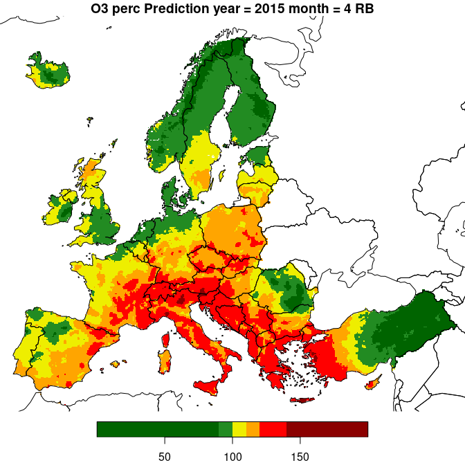

# AQ Interpolation and Map Merging
Johannes Heisig
2025-01-08

``` r
library(dplyr)
library(tictoc)

source("R/functions.R")
```

## Read AQ Data

Daily, monthly, or annual aggregates of AQ measurement data are imported
according using `load_aq()`. Required inputs are the `pollutant`, the
aggregation statistic (‘mean’ or ‘perc’) and a temporal selection.
Specifying only the year (`y`) returns annual data. Additionally,
specifying **either** the month (`m`) **or** the day of the year (`d`)
returns monthly or daily data, respectively.

``` r
y = 2015
m = 4
pollutant = "O3"
stat = "perc"

aq = load_aq(pollutant, stat, y, m) 
```

    Loading monthly O3 data. Year = 2015 ; Month = 4

## Add Covariates

Covariates are then loaded based using `load_covariates_EEA()`. The
temporal extent is extracted from the AQ measurement data object.
Thereby each covariate raster layer is warped to match the spatial grid
of the 1 x 1 km Corine Land Cover (CLC) dataset. Warping is faster when
setting `parallel=TRUE`.

By default our data covers the CAMS grid, which ranges from -25° to 45°
longitude and 30° to 72° latitude. We can limit the extent by supplying
a bounding box in the CRS of the data (*ETRS89-extended / LAEA Europe
(EPSG: 3035)*). For this example we limit the covariates to mainland
Europe and exclude e.g. Azores and Canary Islands.

Note: EEA uses different combinations of covariates for each pollutant,
which the function accounts for.

- PM10: log_cams, elevation, ws, rh, clc
- PM2.5: log_cams, elevation, ws, clc
- O3: cams, elevtion, ws, ssr
- NO2: cams, elevation, elevation 5km, ws, ssr, S5P, pop, clc, clc 5km

``` r
xmin = 2500000
ymin = 1400000
xmax = 7400000 
ymax = 5500000 
sp_ext = terra::ext(xmin, xmax, ymin, ymax)

tic()
aq_cov = load_covariates_EEA(aq, sp_ext)
toc()
```

    1.969 sec elapsed

``` r
aq_cov
```

    stars object with 2 dimensions and 4 attributes
    attribute(s):
                             Min.      1st Qu.       Median         Mean
    CAMS_O3          4.184386e+01 8.088657e+01 8.603809e+01 8.705899e+01
    WindSpeed        7.162301e-01 2.109957e+00 2.634423e+00 2.700291e+00
    Elevation       -3.746848e+00 3.191648e+01 1.761387e+02 3.796029e+02
    SolarRadiation   1.012331e+06 6.962768e+06 8.053143e+06 7.737830e+06
                         3rd Qu.         Max.   NA's
    CAMS_O3         9.295163e+01 1.261244e+02 126113
    WindSpeed       3.174413e+00 8.585591e+00 142222
    Elevation       5.528501e+02 3.201791e+03 125538
    SolarRadiation  9.107425e+06 1.413021e+07 142222
    dimension(s):
      from  to  offset  delta                       refsys x/y
    x    1 490 2500000  10000 ETRS89-extended / LAEA Eu... [x]
    y    1 410 5500000 -10000 ETRS89-extended / LAEA Eu... [y]

## Linear Models per Station-Area/-Type Group

Next, we need to specify the desired combination of station area and
type

- rural background (RB)
- urban background (UB)
- urban traffic (UT)

For each group, linear models are (a) trained and (b) predicted and
finally added to (c) kriging residuals. A post-processing procedure is
applied to merge the three outputs to a single map. In this example we
only use rural background stations as input.

``` r
station_area_type = "RB"
aq = filter_area_type(aq, area_type = station_area_type)              

linmod = linear_aq_model(aq, aq_cov)
summary(linmod)
```


    Call:
    lm(formula = frm, data = aq_join)

    Residuals:
        Min      1Q  Median      3Q     Max 
    -81.366  -7.154  -0.871   6.826  71.976 

    Coefficients:
                     Estimate Std. Error t value Pr(>|t|)    
    (Intercept)     4.180e+01  7.961e+00   5.250 3.01e-07 ***
    CAMS_O3         7.350e-01  8.705e-02   8.443 1.69e-15 ***
    WindSpeed      -3.601e+00  1.074e+00  -3.353 0.000910 ***
    Elevation      -2.545e-03  2.899e-03  -0.878 0.380679    
    SolarRadiation  2.279e-06  6.535e-07   3.487 0.000566 ***
    ---
    Signif. codes:  0 '***' 0.001 '**' 0.01 '*' 0.05 '.' 0.1 ' ' 1

    Residual standard error: 12.73 on 280 degrees of freedom
      (21 observations deleted due to missingness)
    Multiple R-squared:  0.4005,    Adjusted R-squared:  0.3919 
    F-statistic: 46.77 on 4 and 280 DF,  p-value: < 2.2e-16

## Predict Linear Model and Post-Process

Before predicting the linear model we check for missing classes of CLC
data in the training data. The model is not able to make predictions for
land cover classes it has not been trained for. Covariates are thus
masked accordingly. A reason for a CLC class to be missing can be that a
`station_area_type` such as ‘rural background’ by design excludes
e.g. traffic areas.

After prediction, a back-transformation is applied to target variables
which where log-transformed during model building.

``` r
# check for missing land cover classes 
aq_cov = mask_missing_CLC(aq_cov, linmod)

# predict
aq_cov$lm_pred = predict(linmod, newdata = aq_cov)
aq_cov$se = predict(linmod, newdata = aq_cov, se.fit = T)$se.fit
        
# transform back
if (attr(linmod, "log_transformed") == TRUE){
  aq_cov["lm_pred"] = exp(aq_cov["lm_pred"])
  aq_cov["se"] = exp(aq_cov["se"])
}
```

## Residual Kriging

The residuals of the linear model can now be interpolated using
covariates. `krige_aq_residuals()` requires three objects:

- measurements (to retrieve locations)
- covariates (including a post-processed linear model prediction)
- linear model (to retrieve residuals and the formula)

The number of nearest neighbors to consider can be specified with
`n.max`. Kriging can be parallelized with `n.cores` \> 1.

``` r
library(doParallel)
```

    Loading required package: foreach

    Loading required package: iterators

    Loading required package: parallel

``` r
n.cores = 8
cl = makeCluster(n.cores)# , outfile="~/cluster_output.dat")
registerDoParallel(cl)
clusterEvalQ(cl, {
  #.libPaths('~/R/library/');
  library(gstat);
  library(stars)
})
```

    [[1]]
     [1] "stars"     "sf"        "abind"     "gstat"     "stats"     "graphics" 
     [7] "grDevices" "utils"     "datasets"  "methods"   "base"     

    [[2]]
     [1] "stars"     "sf"        "abind"     "gstat"     "stats"     "graphics" 
     [7] "grDevices" "utils"     "datasets"  "methods"   "base"     

    [[3]]
     [1] "stars"     "sf"        "abind"     "gstat"     "stats"     "graphics" 
     [7] "grDevices" "utils"     "datasets"  "methods"   "base"     

    [[4]]
     [1] "stars"     "sf"        "abind"     "gstat"     "stats"     "graphics" 
     [7] "grDevices" "utils"     "datasets"  "methods"   "base"     

    [[5]]
     [1] "stars"     "sf"        "abind"     "gstat"     "stats"     "graphics" 
     [7] "grDevices" "utils"     "datasets"  "methods"   "base"     

    [[6]]
     [1] "stars"     "sf"        "abind"     "gstat"     "stats"     "graphics" 
     [7] "grDevices" "utils"     "datasets"  "methods"   "base"     

    [[7]]
     [1] "stars"     "sf"        "abind"     "gstat"     "stats"     "graphics" 
     [7] "grDevices" "utils"     "datasets"  "methods"   "base"     

    [[8]]
     [1] "stars"     "sf"        "abind"     "gstat"     "stats"     "graphics" 
     [7] "grDevices" "utils"     "datasets"  "methods"   "base"     

``` r
tictoc::tic()
k = krige_aq_residuals_2(aq, aq_cov, linmod, n.max = 10, cv = T,
                       show.vario = F, cluster = cl, verbose = T)
```

    The legacy packages maptools, rgdal, and rgeos, underpinning the sp package,
    which was just loaded, were retired in October 2023.
    Please refer to R-spatial evolution reports for details, especially
    https://r-spatial.org/r/2023/05/15/evolution4.html.
    It may be desirable to make the sf package available;
    package maintainers should consider adding sf to Suggests:.

    Kriging residuals in parallel using 8 cores.

    Splitting new data.

    LOO cross validation.

    Kriging interpolation.

    Completed.  26.819 sec elapsed

``` r
tictoc::toc()
```

    27.21 sec elapsed

``` r
print(attr(k, "loo_cv"))
```

      cv_type         n poll_mean        r2      rmse    r_rmse       mpe 
        "loo"     "285" "112.503"   "0.475"  "11.835"   "10.52"  "-0.053" 

## Result

Model prediction and Kriging output are merged using
`combine_results()`. To limit the linear model prediction to a certain
value range, pass minimum and maximum to `trim_range`.

``` r
result = combine_results(aq_cov, k)#, trim_range = c(0,100))

plot_aq_prediction(result)
```



The example shows interpolated PM10 during April 2020, the time of the
first COVID-19-related lockdowns in Europe. Pollution was relatively low
compared to e.g April 2019.

``` r
plot_aq_se(result)
```


``` r
stopCluster(cl)
```
