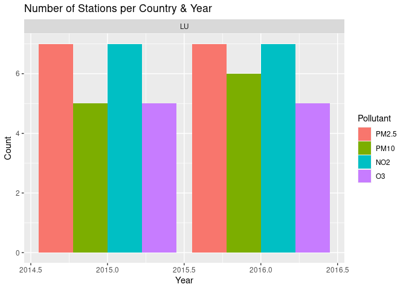

# Download EEA AQ Station Data
Johannes Heisig
2024-01-15

``` r
suppressPackageStartupMessages({
  library(dplyr)
  library(tidyr)
  library(sf)
  library(data.table)
})

source("R/functions.R")
```

# Download

Construct URLS like the [EEA discomap
service](https://discomap.eea.europa.eu/map/fme/AirQualityExport.htm)
that return links to all matching AQ station data CSV files. CSVs each
contain stations from 1 country for 1 year and 1 pollutant.
`generate_download_urls()` first generates a request, executes it, and
writes all matching URLs to file. These can be picked up by
`check_station_urls()` to get corresponding country, year, pollutant,
and station ID for each entry. Data is finally retrieved with
`download_station_data()`.

Download AQ data for 3 countries of interest and 4 pollutants of
interest:

- Netherlands, Belgium, Luxembourg
- NO2, O3, PM10, PM2.5

``` r
countries = c("LU")
pollutants = c(7,8,5,6001)
dl_file = "tests/test_download_urls.txt"

generate_download_urls(countries, pollutants, 2015, 2016, file = dl_file)
```

    Generated 49 station URLs from 1 countries and 4 pollutants between 2015 and 2016

    URLs are written to file: tests/test_download_urls.txt

``` r
check_station_urls(dl_file)
```



``` r
files = download_station_data(dl_file, "tests/download")  

head(files)
```

      Country Pollutant Year Station                           File
    1      LU        O3 2015   27196 LU_7_27196_2015_timeseries.csv
    2      LU        O3 2015   27112 LU_7_27112_2015_timeseries.csv
    3      LU        O3 2015   27176 LU_7_27176_2015_timeseries.csv
    4      LU        O3 2015   27126 LU_7_27126_2015_timeseries.csv
    5      LU        O3 2015   27201 LU_7_27201_2015_timeseries.csv
    6      LU        O3 2016   27196 LU_7_27196_2016_timeseries.csv

# Pre-processing

Combine and filter data to become analysis-ready. Respective functions
use lazy `data.table`-objects created with `dtplyr` to chain processing
steps and execute the efficiently all at once.

**Quality filter:**

- which [validity
  classes](http://dd.eionet.europa.eu/vocabulary/aq/observationvalidity/view)
  should be included?
  - currently 1
- which [verification
  classes](http://dd.eionet.europa.eu/vocabulary/aq/observationverification/view)
  should be included?
  - currently 1 & 2

**Station filter:**

keep background stations from rural, urban, and suburban areas.

Wrangle downloaded CSVs to time series tables with a spatial reference.

1.  read and combine files by pollutant
2.  apply validation / verification flags

``` r
station_meta = arrow::read_parquet("AQ_stations/EEA_stations_meta.parquet")

countries = c("LU")
no2 = read_pollutant_dt(files, pollutant = "NO2", countries = countries) |> filter_quality()
o3 = read_pollutant_dt(files, pollutant = "O3", countries = countries) |> filter_quality()
pm10 = read_pollutant_dt(files, pollutant = "PM10", countries = countries) |> filter_quality()
pm25 = read_pollutant_dt(files, pollutant = "PM2.5", countries = countries) |> filter_quality()
```

3.  join tables to a single time series with measurements of multiple
    pollutants
4.  add station meta data including locations

``` r
pollutants = list(NO2=no2, O3=o3, PM2.5=pm25, PM10=pm10)
poll_table = join_pollutants(pollutants)
```

    Joining: - NO2 - O3 - PM2.5 - PM10

``` r
class(poll_table)
```

    [1] "dtplyr_step_group" "dtplyr_step"      

``` r
poll_table = as.data.table(poll_table)
class(poll_table)
```

    [1] "data.table" "data.frame"

``` r
summary(poll_table)
```

     AirQualityStationEoICode         StationArea        StationType   
     LU0102A:17429            rural         :17295   background:52599  
     LU0104A:17295            rural-nearcity:    0   industrial:    0  
     LU0101A:17150            rural-regional:    0   traffic   :30378  
     LU0108A:16709            rural-remote  :    0                     
     LU0109A:13669            suburban      :  725                     
     LU0106A:  725            urban         :64957                     
     (Other):    0                                                     
       Longitude        Latitude       Elevation      Population        CLC8      
     Min.   :5.847   Min.   :49.51   Min.   :2318   Min.   :  93   HDR    :47528  
     1st Qu.:5.977   1st Qu.:49.60   1st Qu.:2865   1st Qu.:6363   LDR    :18154  
     Median :6.118   Median :49.61   Median :2891   Median :6682   AGR    :17295  
     Mean   :6.038   Mean   :49.61   Mean   :2894   Mean   :5531   IND    :    0  
     3rd Qu.:6.128   3rd Qu.:49.61   3rd Qu.:2965   3rd Qu.:6727   TRAF   :    0  
     Max.   :6.138   Max.   :49.73   Max.   :3045   Max.   :8208   UGR    :    0  
                                                                   (Other):    0  
     DatetimeBegin                         NO2               O3        
     Min.   :2015-01-01 00:00:00.00   Min.   :  0.20   Min.   :  0.00  
     1st Qu.:2015-07-28 00:00:00.00   1st Qu.: 13.90   1st Qu.: 17.00  
     Median :2016-01-17 15:00:00.00   Median : 26.10   Median : 41.00  
     Mean   :2016-01-14 17:12:36.85   Mean   : 30.56   Mean   : 42.12  
     3rd Qu.:2016-07-10 08:00:00.00   3rd Qu.: 42.70   3rd Qu.: 61.00  
     Max.   :2016-12-31 23:00:00.00   Max.   :236.90   Max.   :187.00  
                                      NA's   :2666     NA's   :34106   
         PM2.5             PM10         Countrycode   
     Min.   :  0.00   Min.   :  0.00   LU     :82977  
     1st Qu.:  7.00   1st Qu.: 13.00   AD     :    0  
     Median : 10.00   Median : 19.00   AL     :    0  
     Mean   : 12.55   Mean   : 21.09   AT     :    0  
     3rd Qu.: 16.00   3rd Qu.: 26.00   BA     :    0  
     Max.   :481.00   Max.   :477.00   BE     :    0  
     NA's   :39324    NA's   :35884    (Other):    0  

``` r
purrr::map(poll_table |> select(names(pollutants)), function(x) sum(!is.na(x))) |> unlist()
```

      NO2    O3 PM2.5  PM10 
    80311 48871 43653 47093 

``` r
nrow(poll_table)
```

    [1] 82977

``` r
# Station properties
table(poll_table$AirQualityStationEoICode |> droplevels())
```


    LU0101A LU0102A LU0104A LU0108A LU0109A LU0106A 
      17150   17429   17295   16709   13669     725 

``` r
table(poll_table$StationArea)
```


             rural rural-nearcity rural-regional   rural-remote       suburban 
             17295              0              0              0            725 
             urban 
             64957 

``` r
table(poll_table$StationType)
```


    background industrial    traffic 
         52599          0      30378 

``` r
arrow::write_parquet(poll_table, "tests/LU_hourly_2015-2016_gaps.parquet")
```
