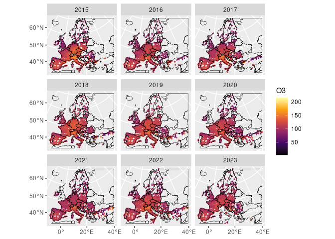

# Temporal Aggregates for EEA AQ Station Data
Johannes Heisig
2024-07-16

## Setup

``` r
library(pbmcapply) # for parallel processing

if (! basename(getwd()) == "UseCase_AIRCON") setwd("UseCase_AIRCON")
source("R/functions.R") 

gapfilled = list.files("AQ_data/03_hourly_gapfilled", full.names = T)
pollutants = c("SO2", "PM10", "PM2.5", "NO2", "O3")
```

## Overview

Interpolated air quality maps for Europe will be processed at a temporal
resolution of days, months, and years. For this reason hourly air
quality (AQ) data needs to be aggregated to coarse temporal steps.
Hourly PM2.5 time series were previously gap-filled. In the aggregation
process the temporal coverage of each pollutant and measurement station
is assessed at daily, monthly and annual level. Time series with
coverage below a certain threshold (e.g. 75%) can be excluded to assure
reliability of the aggregates.

The function `temporal_aggregation()` takes the path to a gap-filled
(country-level) hourly AQ data file, as well as the name of a pollutant
of interest and a threshold for flagging sufficient temporal data
coverage. To calculate a certain percentile instead of the arithmetic
mean, one can supply a value to the `perc` argument. The function
returns only processing time per country file but writes daily, monthly
and annual aggregates directly to file.

Aggregating ozone measurements requires special attention and is
described in more detail below.

## Temporal Means

PM10, PM2.5, O3, SO2, and NO2 are aggregated using the `mean()` function
for all temporal resolutions.

``` r
for (p in pollutants){
  m = pbmclapply(gapfilled, temporal_aggregation, p, cov_threshold = 0.75,
                 keep_validity = 1, keep_verification = c(1,2,3),
                 overwrite = F, mc.cores = 8)
}
```

## PM10: 90.41th percentile of daily means

Beside the mean, PM10 is aggregated using the 90.41th percentile
(formerly 36th highest value) for monthly and annual aggregates.

``` r
pm = pbmclapply(gapfilled, temporal_aggregation, "PM10", 
                perc = 0.9041, cov_threshold = 0.75,
                keep_validity = 1, keep_verification = c(1,2,3),
                overwrite = F, mc.cores = 8)
```

## Ozone: 93.15th percentile of daily maxima of the 8 hour running mean

Ozone data requires a different temporal aggregation method than other
pollutants where averages span over a moving window of 8 hours. Each
station’s O3 time series is filled with missing values for hours where
no observation was recorded. The 8 hour running mean is then calculated
with the requirement of 6 valid (non-missing) values among the 8 values
of interest. Daily aggregates represent the maximum of the 8 hour
running mean within 24 hours. Monthly and annual aggregates represent
the 93.15th percentile of these daily aggregates. A threshold is applied
to flag aggregates which fulfill a certain coverage requirement.

This more complex approach is implemented in
`temporal_aggregation_running()`, which needs considerably longer to
process.

``` r
o3 = purrr::map(gapfilled, temporal_aggregation_running, "O3",
                perc = 0.9315, cov_threshold = 0.75, 
                keep_validity = 1, keep_verification = c(1,2,3),
                overwrite = F)
```

    AD - AL - AT - BA - BE - BG - CH - CY - CZ - DE - DK - EE - ES - FI - FR - GB - GE - GR - HR - HU - IE - IS - IT - LT - LU - LV - ME - MK - MT - NL - NO - PL - PT - RO - RS - SE - SI - SK - TR - UA - XK - 

See below an example output of annual aggregates of O3 measurements.
Next to the station ID, year and aggregated value the table include the
annual daa coverage of the respective station for the specified
pollutant.

``` r
library(arrow)
library(geoarrow)
library(dplyr)

o3_annual = open_dataset("AQ_data/06_annual/O3_max8h_perc") |> 
  collect()

head(o3_annual) 
```

    # A tibble: 6 × 4
      Air.Quality.Station.EoI.Code  year cov.year    O3
      <chr>                        <dbl>    <dbl> <dbl>
    1 AD0942A                       2015    0.972 102. 
    2 AD0942A                       2016    0.920  94.0
    3 AD0942A                       2017    0.954  96.5
    4 AD0942A                       2018    0.968  94.1
    5 AD0942A                       2019    0.914  99.9
    6 AD0942A                       2020    0.983  86.1

Temporal aggregates can be joined with meta data to get a spatial
reference and other station-related information.

``` r
library(sf)

station_meta = read_geoparquet_sf("AQ_stations/EEA_stations_meta_sf.parquet")  

o3_annual_sf = o3_annual |> 
  inner_join(station_meta) |> 
  filter(between(Latitude, 20, 75),        # limit to mainland Europe
         between(Longitude,-12,45)) |> 
  st_as_sf()
```

``` r
library(ggplot2)

# country borders
euro = giscoR::gisco_countries |>   
  st_transform(st_crs(o3_annual_sf)) |> 
  st_crop(o3_annual_sf)

ggplot() +
  geom_sf(aes(color=O3,  geometry = geometry), o3_annual_sf) +
  geom_sf(fill="transparent",alpha = 0, color=1, data = euro) +
  scale_color_viridis_c(option = "B") +
  facet_wrap(~year)
```


