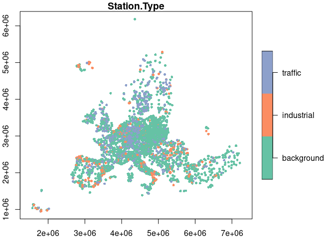

# EEA Air Quality Stations
Johannes Heisig
2024-06-07

Create a table with rows for each station. Each has a type (background,
industrial, traffic), an area label (rural, urban, suburban), and
coordinates in lon/lat. The original station meta data table can be
downloaded from the [EEA
website](https://discomap.eea.europa.eu/App/AQViewer/index.html?fqn=Airquality_Dissem.b2g.measurements)
as CSV. In the following we will read and arrange the table, exclude
unnecessary information and write the result. The first version will
have one entry per sampling point (unique for each pollutant and
station), the second version will only store a single entry per station,
including its location.

``` r
library(dplyr)

station_meta_sampling_point = read.csv("AQ_stations/EEA_station_meta.csv") |> 
  # meta data of interest
  select(Sampling.Point.Id, Air.Quality.Station.EoI.Code, Air.Pollutant, 
         Longitude, Latitude, 
         Station.Area = Air.Quality.Station.Area, 
         Station.Type = Air.Quality.Station.Type) |> 
  # pollutants of interest
  filter(Air.Pollutant %in% c("PM2.5", "PM10", "NO2", "O3")) |> 
  mutate(Air.Pollutant = as.factor(Air.Pollutant),
         Air.Quality.Station.EoI.Code = as.factor(Air.Quality.Station.EoI.Code),
         Countrycode = as.factor(substr(Air.Quality.Station.EoI.Code,1,2)),
         Station.Type = as.factor(Station.Type),
         Station.Area = as.factor(Station.Area)) |> 
  unique() |> 
  # make sure there are no variations in coordinates
  group_by(Sampling.Point.Id, Air.Quality.Station.EoI.Code, Countrycode,
           Station.Type, Station.Area, Air.Pollutant) |>
  summarise(Longitude = mean(Longitude), 
            Latitude = mean(Latitude), 
            .groups = 'drop') |> 
  group_by(Sampling.Point.Id, Station.Area, Air.Pollutant) |> 
  # if two types registered for 1 station, label them as non-background (n=45).
  filter(!(n() > 1 & !Station.Type == "background")) |> 
  ungroup()
```

``` r
# reduce to one entry per station
station_single = select(station_meta_sampling_point, 
                        -Sampling.Point.Id, 
                        -Air.Pollutant) |> 
  unique() |> 
  group_by(Air.Quality.Station.EoI.Code) |> 
  filter(row_number() == 1) |> 
  ungroup()

# turn unique stations into spatial point data
library(sf)
station_single_sf = st_as_sf(station_single, 
                             coords = c("Longitude","Latitude"), 
                             crs = 4326,  
                             remove = F) |> 
  st_transform(st_crs(3035))
```

# Result

Check properties of unique stations.

``` r
# sampling points by station type
table(station_meta_sampling_point$Air.Pollutant, 
      station_meta_sampling_point$Station.Type)
```

           
            background industrial traffic
      NO2         3042        709    2106
      O3          2780        364     384
      PM10        3614        871    1650
      PM2.5       2351        398     871

``` r
# sampling points by station area
table(station_meta_sampling_point$Air.Pollutant, 
      station_meta_sampling_point$Station.Area)
```

           
            rural rural-nearcity rural-regional rural-remote suburban urban
      NO2     620             88            126           31     1257  3735
      O3      587             71            162           49      892  1767
      PM10    594            101            143           29     1442  3826
      PM2.5   363             54            112           26      754  2311

``` r
# station area by station type
table(station_single$Station.Area, 
      station_single$Station.Type)
```

                    
                     background industrial traffic
      rural                 525        165      18
      rural-nearcity         91         26       9
      rural-regional        190          3       5
      rural-remote           49          0       0
      suburban              922        380     216
      urban                1977        273    1890

``` r
summary(station_single)
```

     Air.Quality.Station.EoI.Code  Countrycode       Station.Type 
     AD0942A:   1                 DE     : 961   background:3754  
     AD0944A:   1                 IT     : 821   industrial: 847  
     AD0945A:   1                 FR     : 756   traffic   :2138  
     AL0201A:   1                 ES     : 737                    
     AL0202A:   1                 PL     : 481                    
     AL0203A:   1                 TR     : 348                    
     (Other):6733                 (Other):2635                    
             Station.Area    Longitude          Latitude     
     rural         : 708   Min.   :-63.081   Min.   :-21.34  
     rural-nearcity: 126   1st Qu.:  4.364   1st Qu.: 43.14  
     rural-regional: 198   Median : 10.151   Median : 48.26  
     rural-remote  :  49   Mean   : 10.527   Mean   : 47.27  
     suburban      :1518   3rd Qu.: 17.193   3rd Qu.: 51.22  
     urban         :4140   Max.   : 55.628   Max.   : 78.91  
                                                             

# Write files

``` r
library(arrow)
library(geoarrow)

# sampling points
write_parquet(station_meta_sampling_point, 
              "AQ_stations/EEA_stations_meta_SamplingPoint.parquet")

# stations non-spatial
write_parquet(station_single, 
              "AQ_stations/EEA_stations_meta_table.parquet")

# stations spatial
write_geoparquet(station_single_sf,
                 "AQ_stations/EEA_stations_meta_sf.parquet")
```

# Map

``` r
filter(station_single_sf, between(Longitude, -25, 45))["Station.Type"] |> 
  plot(axes=T, pch=16, cex = 0.7)
```


