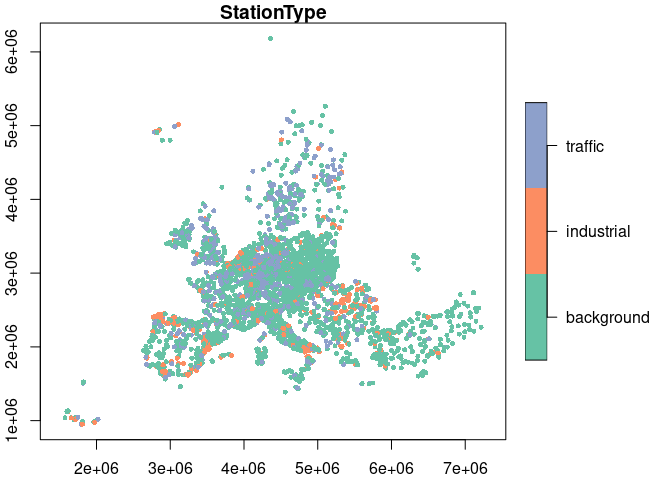

# EEA Air Quality Stations
Johannes Heisig
2024-01-17

``` r
suppressPackageStartupMessages({
  library(dplyr)
  library(tidyr)
  library(sf)
  library(arrow)
  library(geoarrow)
})
```

# Stations

Create a table with rows for each station. Each has a type (background,
industrial, traffic), an area label (rural, urban, suburban), and
coordinates in lon/lat.

Station [meta data
file](https://discomap.eea.europa.eu/map/fme/metadata/PanEuropean_metadata.csv)
comes from EEA.

``` r
station_meta = read.table("AQ_stations/PanEuropean_metadata.csv", 
                          sep = "\t", header = T) |> 
  select(AirQualityStationEoICode, Countrycode, 
         Longitude, Latitude,
         StationType = AirQualityStationType, 
         StationArea = AirQualityStationArea,
         AirPollutant = AirPollutantCode) |> 
  mutate(AirPollutant = factor(basename(AirPollutant),
                               levels = c(6001, 5, 8, 7),
                               labels = c("PM2.5", "PM10", "NO2", "O3"))) |> 
  filter(!is.na(AirPollutant)) |> 
  unique() |> 
  mutate(AirQualityStationEoICode = as.factor(AirQualityStationEoICode),
         Countrycode = as.factor(Countrycode),
         StationType = as.factor(StationType),
         StationArea = as.factor(StationArea)) |> 
  group_by(AirQualityStationEoICode, Countrycode, 
           StationType, StationArea, AirPollutant) |>
  summarise(Longitude = mean(Longitude), 
            Latitude = mean(Latitude), .groups = 'drop') |> 
  group_by(AirQualityStationEoICode, StationArea, AirPollutant) |> 
  # if two types registered for 1 station, label them as non-background (n=45).
  filter(!(n() > 1 & !StationType == "background")) |> 
  ungroup()

station_laea = 
  select(station_meta, AirQualityStationEoICode, Longitude, Latitude) |> 
  unique() |> 
  st_as_sf(coords = c("Longitude","Latitude"), crs = 4326) |> 
  st_transform(st_crs(3035))
```

# Result

``` r
summary(station_meta)
```

     AirQualityStationEoICode  Countrycode       StationType  
     AD0942A:    4            IT     :2135   background:9872  
     AL0203A:    4            ES     :2054   industrial:1934  
     AL0204A:    4            DE     :1966   traffic   :3863  
     AL0205A:    4            FR     :1881                    
     AL0206A:    4            TR     :1241                    
     AL0208A:    4            PL     :1024                    
     (Other):15645            (Other):5368                    
             StationArea   AirPollutant   Longitude          Latitude     
     rural         :1804   PM2.5:2834   Min.   :-63.081   Min.   :-21.34  
     rural-nearcity: 253   PM10 :4660   1st Qu.:  3.236   1st Qu.: 41.67  
     rural-regional: 449   NO2  :5057   Median : 10.670   Median : 46.76  
     rural-remote  : 124   O3   :3118   Mean   : 10.717   Mean   : 46.33  
     suburban      :3564                3rd Qu.: 17.910   3rd Qu.: 50.93  
     urban         :9475                Max.   : 55.628   Max.   : 78.91  
                                                                          

``` r
table(station_meta$AirPollutant, station_meta$StationType)
```

           
            background industrial traffic
      PM2.5       1836        317     681
      PM10        2808        643    1209
      NO2         2720        631    1706
      O3          2508        343     267

``` r
table(station_meta$AirPollutant, station_meta$StationArea)
```

           
            rural rural-nearcity rural-regional rural-remote suburban urban
      PM2.5   271             46             83           21      609  1804
      PM10    473             77            104           25     1075  2906
      NO2     548             71            112           30     1085  3211
      O3      512             59            150           48      795  1554

``` r
table(station_meta$StationArea, station_meta$StationType)
```

                    
                     background industrial traffic
      rural                1421        348      35
      rural-nearcity        201         38      14
      rural-regional        438          7       4
      rural-remote          124          0       0
      suburban             2275        863     426
      urban                5413        678    3384

``` r
station_final = select(station_meta, -AirPollutant) |> 
  group_by(AirQualityStationEoICode, Countrycode) |> 
  filter(row_number()==1)

summary(station_final)
```

     AirQualityStationEoICode  Countrycode       StationType  
     4101422:   1             DE     : 869   background:3538  
     4101522:   1             FR     : 753   industrial: 753  
     AD0942A:   1             IT     : 747   traffic   :1805  
     AD0944A:   1             ES     : 715                    
     AD0945A:   1             PL     : 461                    
     AL0203A:   1             TR     : 348                    
     (Other):6090             (Other):2203                    
             StationArea     Longitude          Latitude     
     rural         : 660   Min.   :-63.081   Min.   :-21.34  
     rural-nearcity: 112   1st Qu.:  3.737   1st Qu.: 42.72  
     rural-regional: 181   Median : 10.012   Median : 48.00  
     rural-remote  :  48   Mean   : 10.413   Mean   : 47.07  
     suburban      :1367   3rd Qu.: 17.172   3rd Qu.: 51.21  
     urban         :3728   Max.   : 55.628   Max.   : 78.91  
                                                             

# Write files

``` r
write_parquet(station_final, "AQ_stations/EEA_stations_meta.parquet")


station_final_sf = st_as_sf(station_final, crs = 4326, remove = F, 
                            coords = c("Longitude","Latitude")) |> 
  st_transform(st_crs(3035)) 

write_geoparquet(station_final_sf, 
                 "AQ_stations/EEA_stations_meta_sf.parquet")
```

``` r
filter(station_final_sf, between(Longitude, -25, 45))["StationType"] |> 
  plot(axes=T, pch=16, cex = 0.7)
```


